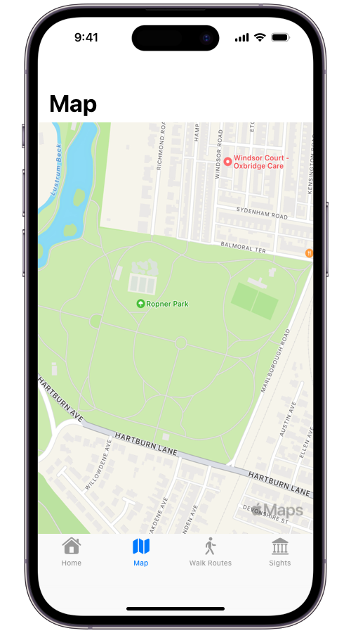
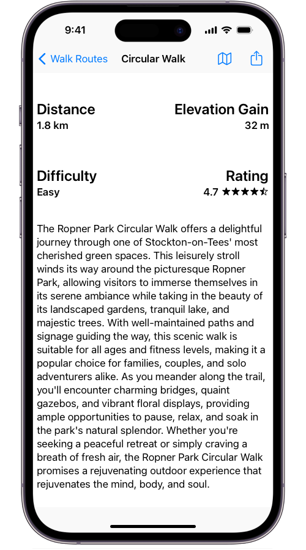
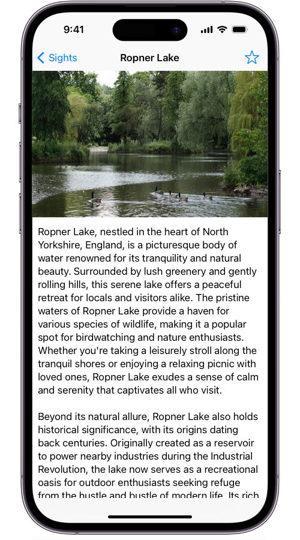

# About the app

The app was meticulously crafted with a singular purpose in mind: to enhance the experience of individuals visiting Ropner Park. With its user-friendly interface and comprehensive features, it serves as an indispensable guide, offering a wealth of information about the park's myriad attractions and scenic walk routes. Whether exploring the tranquil beauty of the park's lush greenery, discovering its historical landmarks, or embarking on leisurely strolls along its winding paths, the app provides invaluable insights and recommendations to ensure visitors make the most of their time in this idyllic setting. By seamlessly blending innovative technology with a deep appreciation for nature and local heritage, the app endeavors to enrich every visitor's journey, fostering a deeper connection with Ropner Park's natural wonders and cultural significance.

---

## Explore the park's various walking routes

Introducing our revolutionary walking routes section, a feature-rich treasure within our app that promises to transform your outdoor experiences like never before. This dynamic platform is your go-to source for finding carefully selected walking routes, enhanced with insightful commentary and comprehensive details about each path's highlights. It was created with convenience and adventure in mind. Not only that, but our walking routes page goes above and beyond by providing a special social feature that allows users to rate, comment on, and share their experiences, building a lively community of outdoor lovers. Whether you're an experienced hiker looking for a fresh challenge or a casual stroller looking for beautiful trails, our walking routes website is the perfect companion for discovering the marvels of nature and meeting like-minded people. 

---

## Discover the picturesque sights of the park
Discover the essence of our locale through the captivating Sights page on our application. Delve into a rich tapestry of landmarks, attractions, and hidden gems that define the cultural and historical fabric of our area. Immerse yourself in detailed descriptions, vibrant imagery, and insightful narratives that bring each sight to life. Whether you're a curious explorer seeking new adventures or a history enthusiast craving deeper insights, our Sights page is your gateway to discovering the heart and soul of our community. Explore, learn, and uncover the stories behind every corner with ease, all within the palm of your hand.

